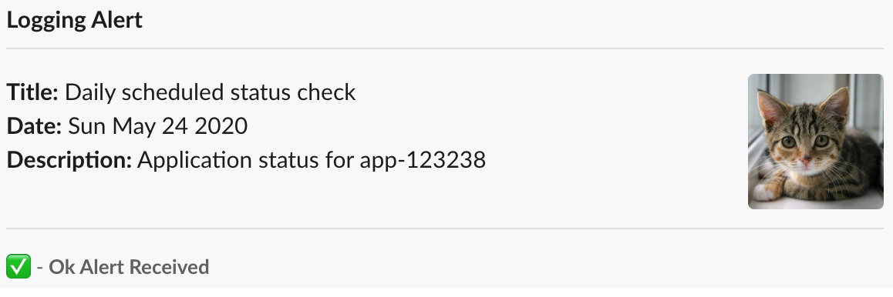

# Slack Message Block Kit w/ JSX Proof-Of-Concept

Testing out slack webhook using the [jsx-slack](https://github.com/speee/jsx-slack) package.
Creating Slack message using [Block Kit](https://api.slack.com/block-kit) using jsx.


## Sample Slack message 




## Getting started


#### 1. Setup enviroment

| Environment varibale        | Description           | Required ?  |
| ------------- |:-------------:| -----:|
| SLACK_MS_WEBHOOK_ENDPOINT      | Your slack webhook endpoint | Yes |
| SLACK_MS_WEBHOOK_CHANNEL      | Your slack channel | Yes |
| SLACK_MS_DEBUG      | Your slack channel | No (optional) |

#### 2. Setup enviroment

```sh

// Execute send slack webhook message
yarn run send-message

// Run watch command for build (src -> lib) 
yarn run build-watch 

// Run build command for build (src -> lib) 
yarn run build 

```

## Technologies

- [Typescript](https://github.com/microsoft/TypeScript), Version 3.9.3
- [React](https://github.com/facebook/react)
- [jsx-slack](https://github.com/speee/jsx-slack)
